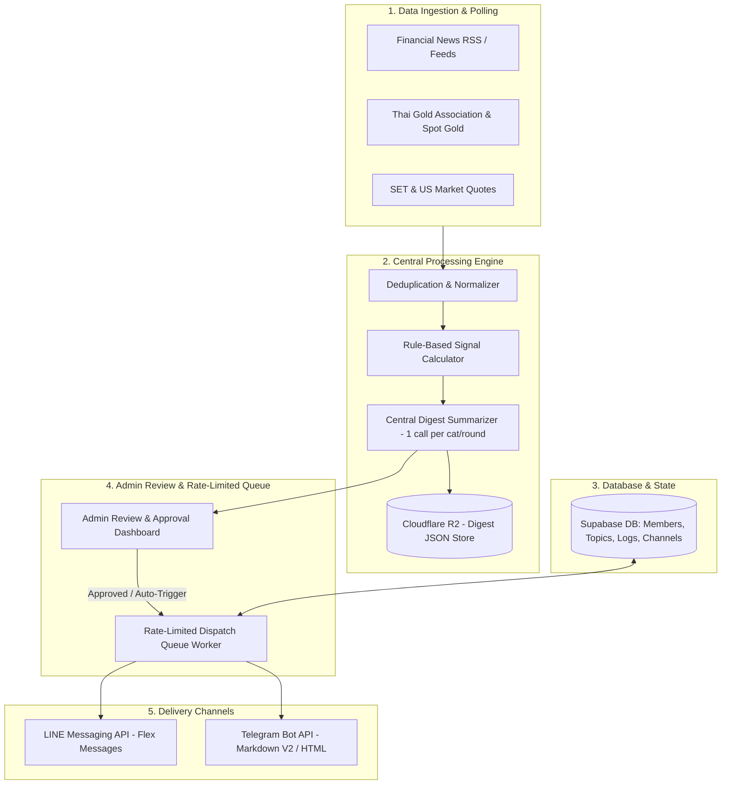

# LINE & Telegram Market Digest & Signal Bot Engine

คู่มือและข้อกำหนดสถาปัตยกรรม (System Architecture & Implementation Blueprint) สำหรับระบบส่งสรุปข่าวการลงทุน (หุ้นไทย/ต่างประเทศ, ราคาทองคำ, ข่าวธุรกิจ) และแจ้งเตือนสัญญาณเทคนิคตามกฎ (Rule-Based Signals) ไปยังสมาชิกผ่าน **LINE Official Account** และ **Telegram Bot** โดยใช้ระบบจัดการกลางชุดเดียวกัน

---

## 1. System Topology & Core Architecture



---

## 2. Subscription Data Model (Supabase Schema)

```sql
-- 1. Bot Subscribers Table
CREATE TABLE public.bot_subscribers (
  id UUID PRIMARY KEY DEFAULT gen_random_uuid(),
  user_id UUID REFERENCES auth.users(id) ON DELETE SET NULL,
  channel VARCHAR(20) NOT NULL, -- 'line' | 'telegram'
  channel_user_id VARCHAR(100) NOT NULL, -- LINE userId or Telegram chatId
  display_name VARCHAR(150),
  categories TEXT[] DEFAULT ARRAY['stocks', 'gold', 'business'], -- 'stocks', 'gold', 'business'
  delivery_rounds TEXT[] DEFAULT ARRAY['morning', 'evening'], -- 'morning', 'evening'
  is_active BOOLEAN DEFAULT true,
  is_paused BOOLEAN DEFAULT false,
  link_token VARCHAR(32), -- One-time linking token for merging LINE & Telegram
  created_at TIMESTAMPTZ DEFAULT NOW(),
  updated_at TIMESTAMPTZ DEFAULT NOW(),
  UNIQUE(channel, channel_user_id)
);

-- 2. Central Digest Archives Table
CREATE TABLE public.bot_digest_archives (
  id UUID PRIMARY KEY DEFAULT gen_random_uuid(),
  round_date DATE NOT NULL,
  round_type VARCHAR(20) NOT NULL, -- 'morning' (08:00) | 'evening' (18:00)
  category VARCHAR(50) NOT NULL, -- 'stocks' | 'gold' | 'business' | 'macro'
  summary_text TEXT NOT NULL,
  highlights JSONB NOT NULL DEFAULT '[]', -- Top 3-5 news
  market_snapshot JSONB NOT NULL DEFAULT '{}', -- Gold / SET / FX rates
  signals_detected JSONB NOT NULL DEFAULT '[]', -- Rule-based signals
  status VARCHAR(20) DEFAULT 'draft', -- 'draft' | 'approved' | 'sent' | 'cancelled'
  approved_by VARCHAR(100),
  sent_at TIMESTAMPTZ,
  created_at TIMESTAMPTZ DEFAULT NOW(),
  UNIQUE(round_date, round_type, category)
);

-- 3. Delivery Log Table (Deduplication & Quota tracking)
CREATE TABLE public.bot_delivery_logs (
  id UUID PRIMARY KEY DEFAULT gen_random_uuid(),
  subscriber_id UUID REFERENCES public.bot_subscribers(id) ON DELETE CASCADE,
  digest_id UUID REFERENCES public.bot_digest_archives(id) ON DELETE CASCADE,
  channel VARCHAR(20) NOT NULL,
  round_type VARCHAR(20) NOT NULL,
  status VARCHAR(20) NOT NULL, -- 'queued' | 'sent' | 'failed' | 'blocked'
  error_message TEXT,
  sent_at TIMESTAMPTZ DEFAULT NOW()
);
```

---

## 3. Message Delivery Format & Quota Management

### A. LINE Messaging API (Strict 100% Free Tier Policy - 0 บาท)
- **กลยุทธ์จำกัดโควต้าฟรี (Zero-Cost Architecture)**:
  - 🟢 **Reply Message (ผ่าน Rich Menu)**: **ฟรี 100% ไม่จำกัดจำนวนครั้ง และไม่กินโควต้า Push แม้แต่ข้อความเดียว!**
  - 🔴 **Push Message**: LINE ให้โควต้าฟรี 300-500 ข้อความ/เดือนเท่านั้น **ห้ามยิง Push รายวันเป็นรายคนเด็ดขาดเพื่อไม่ให้มีค่าบริการ**
- **วิธีจัดส่งบน LINE**:
  1. **โหมด On-Demand ผ่าน Rich Menu 6 ช่อง (หลัก)**:
     - สมาชิกกดเมนู 📊 สรุปหุ้น, 🥇 ราคาทอง, 📰 ข่าวธุรกิจ, 📈 สัญญาณเทคนิค -> ระบบตอบกลับด้วย **Reply Message ทันที (0 บาท ไม่จำกัดจำนวนครั้ง)**
  2. **Push Message โควต้าฟรี 300 ข้อความ/ด.**:
     - สงวนไว้เฉพาะการต้อนรับสมาชิกใหม่ หรือส่งสรุปภาพรวมใหญ่สัปดาห์ละ 1 ครั้งเท่านั้น
  3. **การชวนไปรับ Push บน Telegram**:
     - สมาชิกใน LINE ที่ต้องการรับแจ้งเตือนอัตโนมัติวันละ 2 รอบ (08:00 และ 18:00 น.) ให้กดปุ่มบน Rich Menu เพื่อเชื่อมต่อไปรับบน **Telegram Bot (ฟรีไม่จำกัด 100%)**

### B. Telegram Bot API (100% Free Unlimited Push Broadcast)
- **Format**: MarkdownV2 หรือ HTML Message พร้อม Inline Keyboard ปุ่มปรับแต่งค่า
- **Cost**: **0 บาทตลอดชีพ (ฟรี 100% ไม่จำกัดจำนวนผู้รับและจำนวนรอบส่ง)**
- **Rate Limit**: ห้ามส่งเกิน **30 ข้อความ/วินาที** สู่ผู้รับต่างกัน และไม่เกิน **1 ข้อความ/วินาที** สู่แชทเดิม
- **Commands**:
  - `/start`: แสดงตัวเลือกสมัครและหมวดหมู่
  - `/settings`: ปรับแต่งหมวดข่าวและรอบเวลา
  - `/pause`: พักการรับข่าวชั่วคราว
  - `/link`: เชื่อมบัญชีเข้ากับระบบสมาชิกกลาง

---

## 4. Signal Calculation Rules (Rule-Based Engine)

ทุกสัญญาณต้องคำนวณจากกฎทางคณิตศาสตร์ที่โปร่งใส ไม่ใช้ AI คาดเดา:
1. **Price Momentum**: หุ้นใน SET100 หรือ Spot Gold ขยับเกิน `±2.5%` ภายในรอบ
2. **Breakout / Milestone**: ราคาทองคำแท่ง 96.5% ทะลุระดับสำคัญ (เช่น ทุก 500 บาท)
3. **Volume Spike**: ปริมาณซื้อขายเกิน `1.5x` ของค่าเฉลี่ย 5 วันทำการ
4. **Major Disclosures**: สารสนเทศแจ้งตลาดหลักทรัพย์ประเภท XD (ปันผล), งบการเงิน, การควบรวมกิจการ (M&A)

---

## 5. Cost Breakdown & Budget (Strict 100% Free Quota - 0 บาท)

| ส่วนประกอบระบบ | โควต้าที่ใช้ | ค่าใช้จ่าย | หมายเหตุการควบคุมต้นทุน |
| :--- | :--- | :--- | :--- |
| **LINE Official Account** | Free Tier (Reply Messages ไม่จำกัด) | **0 บาท / เดือน** | สมาชิกกดดูผ่าน Rich Menu (Reply Token ฟรี 100%) ไม่เสียค่า Push |
| **Telegram Bot API** | ไม่จำกัด (Unlimited Broadcast) | **0 บาท / เดือน** | รองรับการยิง Push อัตโนมัติ 2 รอบ/วัน สมาชิก 100-500+ คน ฟรี 100% |
| **Database (Supabase)** | Free Tier (500MB DB, 50k MAU) | **0 บาท / เดือน** | เก็บเฉพาะ Preferences และ Channel ID เล็กๆ |
| **Storage (Cloudflare R2)** | Free Tier (10GB, Zero Egress) | **0 บาท / เดือน** | เก็บไฟล์ JSON สรุปข่าวกลาง ($0.00 Egress fee) |
| **AI Engine (Gemini Flash)** | Free Tier (15 RPM / 1,500 RPD) | **0 บาท / เดือน** | สรุปกลาง 1 ครั้งต่อหมวดต่อรอบ (ใช้วันละ 6 ครั้งจากโควต้า 1,500 ครั้ง) |
| **รวมงบประมาณรายเดือนทั้งหมด** | **100% FREE TIER** | **0 บาท / เดือน** | **ไม่มีค่าใช้จ่ายแอบแฝง รันระบบได้ฟรีสมบูรณ์แบบ** |

---

## 6. Implementation Checklist

- [ ] **Step 1: บัญชีและ Token (Free Tier)**
  - สมัคร LINE Official Account (Free Package) & เปิดใช้ Messaging API
  - สร้าง Telegram Bot ผ่าน `@BotFather`
  - ออกแบบ LINE Rich Menu 6 ช่อง (สรุปหุ้น, ราคาทอง, ข่าวธุรกิจ, สัญญาณ, ตั้งค่า, รับบน Telegram ฟรี)
- [ ] **Step 2: Database Schema & Webhook Handler**
  - รัน Migration ตาราง `bot_subscribers`, `bot_digest_archives`, `bot_delivery_logs`
  - สร้าง Webhook Endpoint สำหรับ LINE (`/api/bot/line/webhook`) และ Telegram (`/api/bot/telegram/webhook`)
  - ใช้ `replyMessage` สำหรับทุกคำขอจาก LINE Rich Menu (0 บาท ไม่กินโควต้า Push)
- [ ] **Step 3: Central Aggregator & Cron Job**
  - สรุปข่าวกลางและสัญญาณรอบ 07:30 และ 17:30 น.
  - ย่อสรุปด้วย Gemini Flash Free Tier และบันทึกลง `bot_digest_archives`
- [ ] **Step 4: หน้า Admin Review Dashboard**
  - ผู้ดูแลตรวจข้อความและกดยืนยัน (Approved) ก่อนเวลา 08:00 และ 18:00 น.
- [ ] **Step 5: Telegram Push & LINE On-Demand Engine**
  - กระจาย Push อัตโนมัติไปยังสมาชิก Telegram ตามรอบ
  - อัปเดตข้อมูลกลางพร้อมให้สมาชิก LINE กดอ่านผ่าน Rich Menu ได้ทันที 24 ชม.

