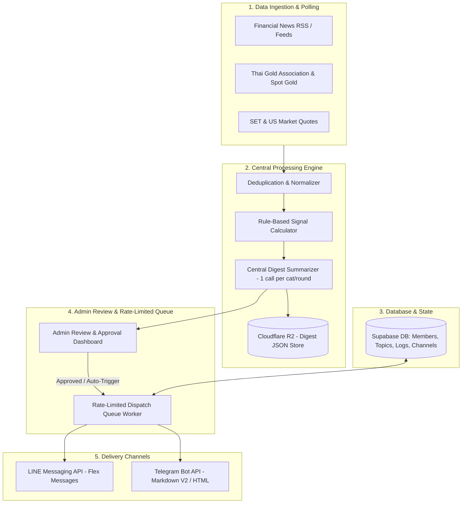

# LINE & Telegram Market Digest & Signal Bot Engine

คู่มือและข้อกำหนดสถาปัตยกรรม (System Architecture & Implementation Blueprint) สำหรับระบบส่งสรุปข่าวการลงทุน (หุ้นไทย/ต่างประเทศ, ราคาทองคำ, ข่าวธุรกิจ) และแจ้งเตือนสัญญาณเทคนิคตามกฎ (Rule-Based Signals) ไปยังสมาชิกผ่าน **LINE Official Account** และ **Telegram Bot** โดยใช้ระบบจัดการกลางชุดเดียวกัน

---

## 1. System Topology & Core Architecture



---

## 2. Subscription Data Model (Supabase Schema)

```sql
-- 1. Bot Subscribers Table
CREATE TABLE public.bot_subscribers (
  id UUID PRIMARY KEY DEFAULT gen_random_uuid(),
  user_id UUID REFERENCES auth.users(id) ON DELETE SET NULL,
  channel VARCHAR(20) NOT NULL, -- 'line' | 'telegram'
  channel_user_id VARCHAR(100) NOT NULL, -- LINE userId or Telegram chatId
  display_name VARCHAR(150),
  categories TEXT[] DEFAULT ARRAY['stocks', 'gold', 'business'], -- 'stocks', 'gold', 'business'
  delivery_rounds TEXT[] DEFAULT ARRAY['morning', 'evening'], -- 'morning', 'evening'
  is_active BOOLEAN DEFAULT true,
  is_paused BOOLEAN DEFAULT false,
  link_token VARCHAR(32), -- One-time linking token for merging LINE & Telegram
  created_at TIMESTAMPTZ DEFAULT NOW(),
  updated_at TIMESTAMPTZ DEFAULT NOW(),
  UNIQUE(channel, channel_user_id)
);

-- 2. Central Digest Archives Table
CREATE TABLE public.bot_digest_archives (
  id UUID PRIMARY KEY DEFAULT gen_random_uuid(),
  round_date DATE NOT NULL,
  round_type VARCHAR(20) NOT NULL, -- 'morning' (08:00) | 'evening' (18:00)
  category VARCHAR(50) NOT NULL, -- 'stocks' | 'gold' | 'business' | 'macro'
  summary_text TEXT NOT NULL,
  highlights JSONB NOT NULL DEFAULT '[]', -- Top 3-5 news
  market_snapshot JSONB NOT NULL DEFAULT '{}', -- Gold / SET / FX rates
  signals_detected JSONB NOT NULL DEFAULT '[]', -- Rule-based signals
  status VARCHAR(20) DEFAULT 'draft', -- 'draft' | 'approved' | 'sent' | 'cancelled'
  approved_by VARCHAR(100),
  sent_at TIMESTAMPTZ,
  created_at TIMESTAMPTZ DEFAULT NOW(),
  UNIQUE(round_date, round_type, category)
);

-- 3. Delivery Log Table (Deduplication & Quota tracking)
CREATE TABLE public.bot_delivery_logs (
  id UUID PRIMARY KEY DEFAULT gen_random_uuid(),
  subscriber_id UUID REFERENCES public.bot_subscribers(id) ON DELETE CASCADE,
  digest_id UUID REFERENCES public.bot_digest_archives(id) ON DELETE CASCADE,
  channel VARCHAR(20) NOT NULL,
  round_type VARCHAR(20) NOT NULL,
  status VARCHAR(20) NOT NULL, -- 'queued' | 'sent' | 'failed' | 'blocked'
  error_message TEXT,
  sent_at TIMESTAMPTZ DEFAULT NOW()
);
```

---

## 3. Message Delivery Format & Quota Management

### A. LINE Messaging API (Flex Message)
- **Format**: Single unified **Flex Message Carousel / Bubble** ต่อรอบ เพื่อให้สมาชิกอ่านง่ายและนับเป็น **1 Push Message เท่านั้น** (ประหยัดโควต้าข้อความ)
- **Rate Limit**: สูงสุด ~2,000 requests/นาที
- **Webhook Events**:
  - `follow`: สมัครสมาชิกใหม่ และแสดง Rich Menu ตั้งค่า
  - `unfollow`: อัปเดต `is_active = false` ป้องกันการส่งซ้ำ
  - `message`: ตอบกลับคำสั่ง `ตั้งค่าข่าว`, `เปลี่ยนรอบ`, `หยุดรับชั่วคราว`, `ยกเลิก`

### B. Telegram Bot API
- **Format**: MarkdownV2 หรือ HTML Message พร้อม Inline Keyboard ปุ่มปรับแต่งค่า
- **Rate Limit**: ห้ามส่งเกิน **30 ข้อความ/วินาที** สู่ผู้รับต่างกัน และไม่เกิน **1 ข้อความ/วินาที** สู่แชทเดิม
- **Commands**:
  - `/start`: แสดงตัวเลือกสมัครและหมวดหมู่
  - `/settings`: ปรับแต่งหมวดข่าวและรอบเวลา
  - `/pause`: พักการรับข่าวชั่วคราว
  - `/link`: เชื่อมบัญชีเข้ากับระบบสมาชิกกลาง

---

## 4. Signal Calculation Rules (Rule-Based Engine)

ทุกสัญญาณต้องคำนวณจากกฎทางคณิตศาสตร์ที่โปร่งใส ไม่ใช้ AI คาดเดา:
1. **Price Momentum**: หุ้นใน SET100 หรือ Spot Gold ขยับเกิน `±2.5%` ภายในรอบ
2. **Breakout / Milestone**: ราคาทองคำแท่ง 96.5% ทะลุระดับสำคัญ (เช่น ทุก 500 บาท)
3. **Volume Spike**: ปริมาณซื้อขายเกิน `1.5x` ของค่าเฉลี่ย 5 วันทำการ
4. **Major Disclosures**: สารสนเทศแจ้งตลาดหลักทรัพย์ประเภท XD (ปันผล), งบการเงิน, การควบรวมกิจการ (M&A)

---

## 5. Cost Breakdown & Budgeting (100–500 Members)

| รายการ | ผู้รับ 100 คน | ผู้รับ 300 คน | ผู้รับ 500 คน | หมายเหตุ |
| :--- | :--- | :--- | :--- | :--- |
| **Telegram Bot API** | **0 บาท** | **0 บาท** | **0 บาท** | ฟรี 100% ไม่มีค่า Push Message |
| **LINE Official Account (Push Fee)** | **1,200 บาท/ด.** (Basic) | **1,500 บาท/ด.** (Pro) | **1,500 บาท/ด.** (Pro) | คิดตามรอบส่ง 2 รอบ/วัน (Flex Message นับ 1 bubble/รอบ) |
| **เซิร์ฟเวอร์ & Database (Supabase + Next.js)** | **0 บาท** (Free Tier) | **0 บาท** (Free Tier) | **0 – 800 บาท/ด.** | ใช้ Supabase Free + R2 Zero Egress |
| **AI Summarizer (Gemini Flash)** | **< 10 บาท/ด.** | **< 10 บาท/ด.** | **< 10 บาท/ด.** | สรุปกลาง 6 ครั้ง/วัน รวม ~180 ครั้ง/ด. |
| **รวมงบประมาณโดยประมาณ** | **~1,200 บาท/เดือน** | **~1,500 บาท/เดือน** | **~1,500 – 2,300 บาท/เดือน** | คุ้มค่าและควบคุมค่าใช้จ่ายได้แน่นอน |

---

## 6. Implementation Checklist

- [ ] **Step 1: บัญชีและ Token**
  - สมัคร LINE Official Account & เปิดใช้ LINE Messaging API Channel
  - สร้าง Telegram Bot ผ่าน `@BotFather` และรับ `BOT_TOKEN`
- [ ] **Step 2: Database Schema & Webhook Handler**
  - รัน Migration ตาราง `bot_subscribers`, `bot_digest_archives`, `bot_delivery_logs`
  - สร้าง Webhook Endpoint สำหรับ LINE (`/api/bot/line/webhook`) และ Telegram (`/api/bot/telegram/webhook`)
- [ ] **Step 3: Central Aggregator & Cron Job**
  - สร้างฟังก์ชันรวบรวมข่าวและราคาทอง/หุ้นรอบ 07:30 และ 17:30 น.
  - ย่อสรุปกลางด้วย AI และบันทึกลง `bot_digest_archives`
- [ ] **Step 4: หน้า Admin Review Dashboard**
  - ผู้ดูแลตรวจข้อความและกดยืนยัน (Approved) ก่อนเวลา 08:00 และ 18:00 น.
- [ ] **Step 5: Queue Dispatcher**
  - ยิงข้อความกระจายตามคิวพร้อมระบบ Retry และ Rate Limiting
